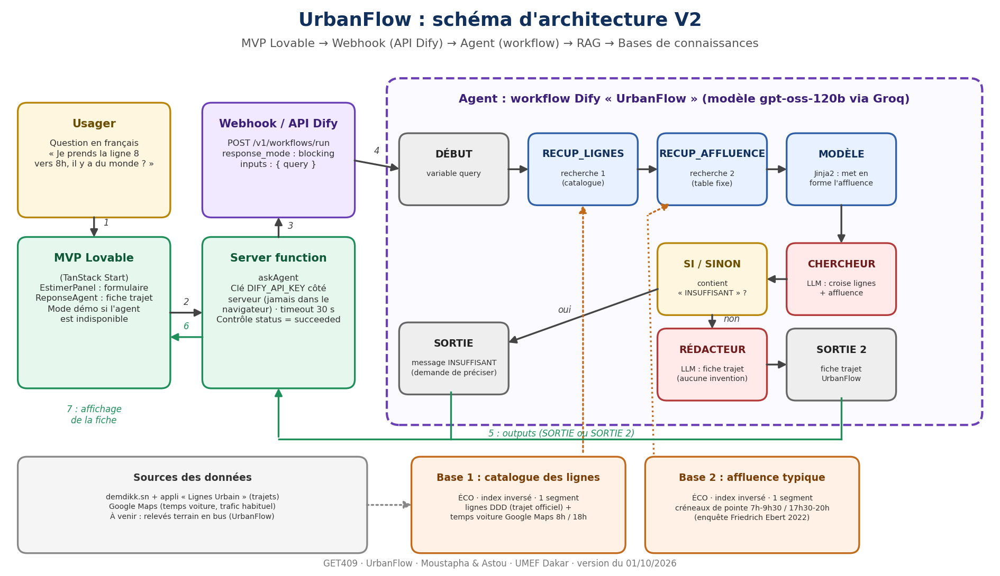

# Schéma d'architecture V2 (L3)

MVP Lovable, webhook (API Dify), agent (workflow), RAG, bases de connaissances.

Version PDF : [`schema/UrbanFlow_Schema_Archi_V2.pdf`](schema/UrbanFlow_Schema_Archi_V2.pdf)

**Lecture du flux :**
1. L'usager pose sa question dans le MVP Lovable.
2. Le formulaire appelle la server function `askAgent` (la clé `DIFY_API_KEY` reste côté serveur).
3. `askAgent` envoie `POST /v1/workflows/run` à Dify (mode blocking, `inputs: { query }`).
4. Le workflow enchaîne DÉBUT, RECUP_LIGNES (base 1), RECUP_AFFLUENCE (base 2), MODÈLE, CHERCHEUR, puis SI/SINON.
5. Si la réponse contient INSUFFISANT, SORTIE renvoie un message demandant de préciser ; sinon le RÉDACTEUR produit la fiche trajet (SORTIE 2).
6. `askAgent` vérifie `status === "succeeded"` et renvoie le texte.
7. Le MVP affiche la fiche (ou le mode démo si l'agent est indisponible).

Modèle : gpt-oss-120b via Groq, séparation du raisonnement activée. Bases en mode Économique (index inversé), un seul segment chacune.
